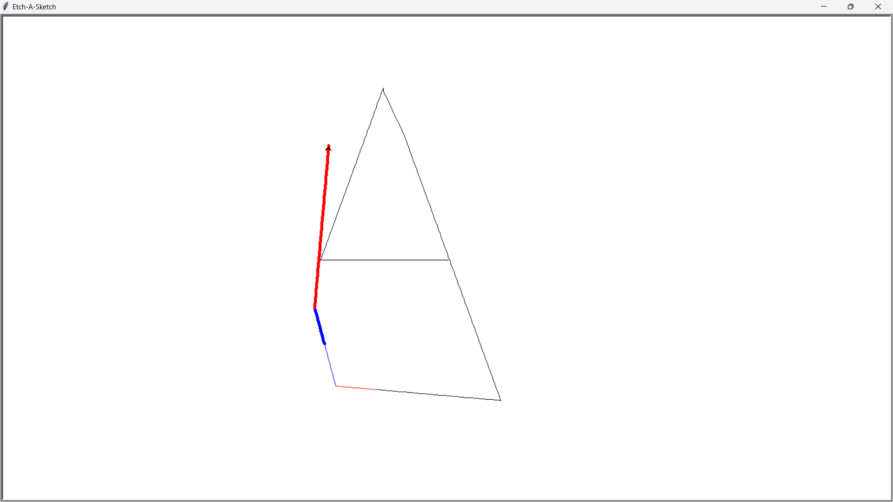

# Etch-A-Sketch 

A simple **Etch-A-Sketch** program built using Python's **Turtle Graphics**. This interactive drawing application allows you to move the turtle with keyboard controls, change colors, adjust pen width, and even erase drawings.

## Features 
- Move the turtle **forwards, backwards, left, and right**
- **Change pen color** by selecting from a list of options
- **Adjust pen width** (between 1-10)
- **Erase drawings** by switching to an eraser mode
- **Clear the screen** and reset the turtle's position
- **Exit the program** using the spacebar

## Controls 
| Key | Action |
|------|------------------------------|
| `W` | Move forward |
| `S` | Move backward |
| `A` | Turn left |
| `D` | Turn right |
| `F` | Change pen color |
| `G` | Adjust pen width |
| `E` | Eraser mode (white pen) |
| `R` | Return to selected pen color |
| `C` | Clear the screen |
| `SPACE` | Exit program |

## Installation & Running 
1. Make sure you have Python installed (3.x recommended).
2. Clone this repository:
   ```sh
   git clone https://github.com/NomadBeetle/Etch-A-Sketch.git
   ```
3. Navigate to the project directory:
   ```sh
   cd Etch-A-Sketch
   ```
4. Run the program:
   ```sh
   python main.py
   ```

## Preview 


## Improvements & Future Additions 
- Add **mouse support** for freehand drawing
- Implement a **GUI menu** for changing colors instead of text input
- Introduce **custom color selection**

## Connect with Me 
- **GitHub**: [NomadBeetle](https://github.com/NomadBeetle)
- **LeetCode**: [NomadBeetle](https://leetcode.com/u/NomadBeetle/)
- **LinkedIn**: [Azaan Ahmed](https://www.linkedin.com/in/azaan-ahmed-a738b4332/)

---
Made with <3 by **Azaan Ahmed**

